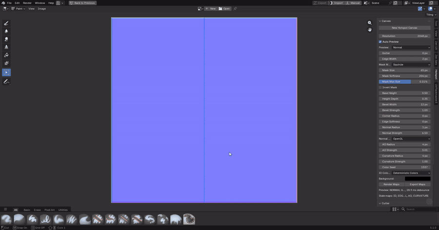

# Hotspot Base Map Generator

Blender 5.0+ extension for generating hotspot texture bases: rectangular atlas maps you can use as a starting point in external texturing tools.

## Demo

[Watch the demo video](media/hotspot-base-map-generator-demo.mp4)

## Scope

Hotspot Base Map Generator creates base maps for hotspot texture workflows. It does not generate complete finished hotspot textures, and it does not UV-map meshes to a hotspot atlas.

If you need hotspot UV mapping, check out [Zen UV](https://superhivemarket.com/products/zen-uv) (paid) or [DreamUV](https://github.com/leukbaars/DreamUV) (free).

## Features

- One scene-level hotspot canvas stored as Blender scene property data.
- Image Editor sidebar panels for canvas, cutter, region, overlay, and export controls.
- Recursive horizontal/vertical region splits with arbitrary ratios.
- Equal `2x2` and custom rows/columns grid subdivision.
- Image Editor Paint toolbar cutter tool with midpoint, unsnapped, loop-cut, and square-grid cut modes.
- Live debounced GPU preview in the Image Editor, with optional slow CPU fallback.
- Generated ID, Edge, Mask, Height, Normal, AO, and Curvature maps.
- Deterministic color, sequential grayscale, and stored per-region color modes.
- Global rendered gutter/padding, hard edge width, height/bevel, normal, AO, and curvature settings.
- PNG export using map suffixes such as `<stem>_ID.png`, `<stem>_Normal.png`, and `<stem>_Curvature.png`.

## Installation

1. Download the latest `hotspot_base_map_generator-*.zip` from Releases.
2. In Blender, open Preferences, then Extensions.
3. Use Install from Disk and select the zip file.
4. Enable Hotspot Base Map Generator.

## Basic Use

1. Open the Image Editor.
2. Create a hotspot canvas from the Hotspot sidebar.
3. Split regions with the sidebar controls or the cutter tool.
4. Preview the generated maps in Blender.
5. Export the selected PNG maps for use in your texturing workflow.
